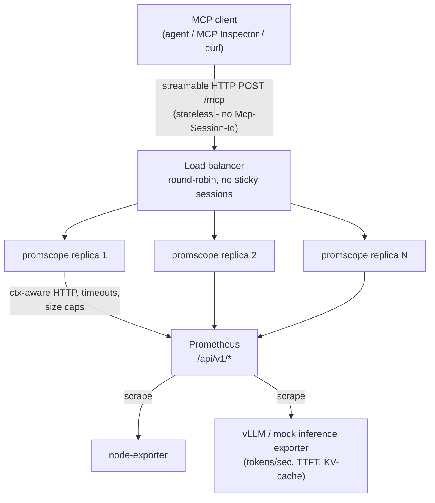
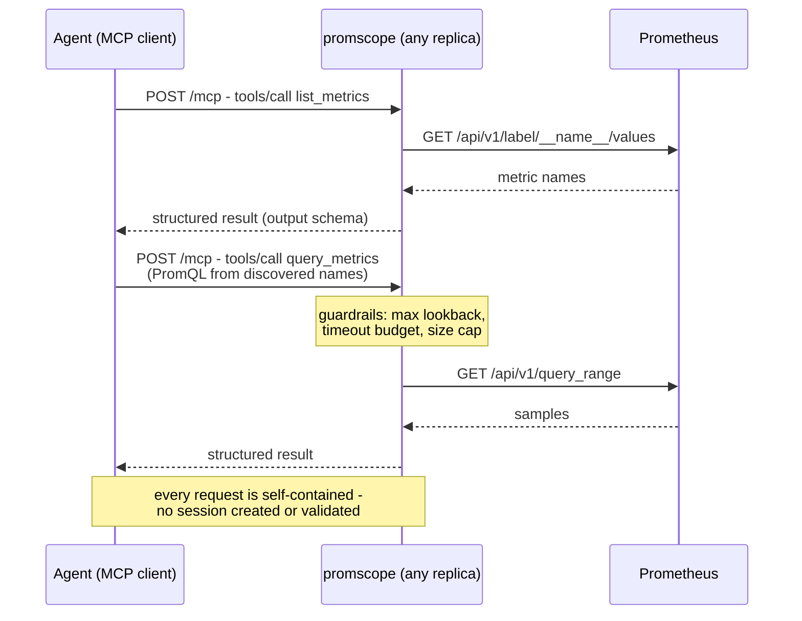

# promscope

**A stateless MCP server for LLM inference observability, in Go.**

promscope gives AI agents read-only access to Prometheus over the
[Model Context Protocol](https://modelcontextprotocol.io), built with the official
[Go SDK](https://github.com/modelcontextprotocol/go-sdk) in **stateless streamable-HTTP
mode** - no sessions, no sticky load balancing, horizontally scalable by construction.

The tools are intentionally minimal. The point of this project is the infrastructure:
what MCP's stateless mode actually changes, which protocol features survive it, and what
a production-minded MCP server looks like in Go.

> Framing: [vLLM](https://docs.vllm.ai) natively exports Prometheus metrics
> (tokens/sec, time-to-first-token, KV-cache usage). promscope is the bridge that lets an
> agent *ask questions* about an inference fleet.

## Architecture



Because the server holds **zero per-client state** and the Prometheus HTTP API is itself
stateless, any replica can serve any request - the whole stack is honestly stateless
end-to-end.

## Tool call flow



## Surface

| Name | Kind | What it does |
|---|---|---|
| `list_metrics` | tool | Discover metric names and labels (optional filter). Discovery-first: an LLM can't write PromQL for metrics it can't see. |
| `query_metrics` | tool | PromQL instant/range query with server-side guardrails (max lookback, timeout, result size cap). |
| `get_alerts` | tool | Firing and pending alerts. |
| `prometheus://rules` | resource | Alert/recording rule configuration as an MCP resource. |

All tools are annotated `readOnlyHint` / `idempotentHint` and return **structured content
with output schemas** - typed results, not string blobs.

## Why stateless?

The MCP spec is heading toward a sessionless revision, and stateless streamable HTTP is
the migration path. In the Go SDK this is `StreamableHTTPHandler{Stateless: true}`:

- no `Mcp-Session-Id` created or validated - every POST is self-contained
- replicas scale horizontally behind any dumb load balancer
- the trade-off: standalone SSE streams, resource subscriptions, and server-initiated
  notifications need a session and are **out** - this repo documents exactly where that
  boundary is

## Quickstart

```bash
docker compose -f deploy/compose.yaml up -d --build
```

That starts the full demo: Prometheus scraping node-exporter, a **mock vLLM
exporter** (verbatim `vllm:*` metric names, simulated values - swap in a real
vLLM endpoint with one scrape-config change, see `deploy/prometheus.yml`),
and **two stateless promscope replicas behind nginx round-robin** on
`http://localhost:8090/mcp`. The `X-Promscope-Backend` response header shows
which replica answered.

Try it with the [MCP Inspector](https://github.com/modelcontextprotocol/inspector)
(`npx @modelcontextprotocol/inspector`, transport Streamable HTTP) or replay
the requests in [`docs/m2-tools.http`](docs/m2-tools.http). For local
development without Docker: `go run ./cmd/promscope` against any Prometheus.

Operational endpoints on each replica: `/healthz` (liveness) and `/metrics`
(promscope's own request counts, latencies, and upstream call outcomes).

## Configuration

Flags or `PROMSCOPE_*` env vars (flag > env > default; malformed values
refuse to boot). Guardrail limits must be identical across replicas.

| Env var | Default | Meaning |
|---|---|---|
| `PROMSCOPE_LISTEN_ADDR` | `:8090` | HTTP listen address |
| `PROMSCOPE_PROMETHEUS_URL` | `http://localhost:9090` | Upstream Prometheus |
| `PROMSCOPE_STATELESS` | `true` | Stateless transport (false exists solely for the load-test A/B) |
| `PROMSCOPE_MAX_LOOKBACK` | `24h` | Widest range-query window |
| `PROMSCOPE_MAX_SERIES` | `50` | Series per result before truncation |
| `PROMSCOPE_MAX_POINTS` | `200` | Points-per-series budget (drives step auto-compute) |
| `PROMSCOPE_QUERY_TIMEOUT` | `10s` | Outer per-query budget; Prometheus gets 90% |
| `PROMSCOPE_MAX_METRIC_NAMES` | `500` | list_metrics cap |
| `PROMSCOPE_MAX_RESPONSE_BYTES` | `1048576` | Cap on any upstream response body |

## Accepted limitations

- **No auth** - deliberate scope decision; front it with your own gateway if exposed.
- **Read-only** - no write path exists.
- Three tools, frozen. Robustness over surface area.

See [docs/SPEC.md](docs/SPEC.md) for the full specification, architecture decisions, and
milestone plan.
