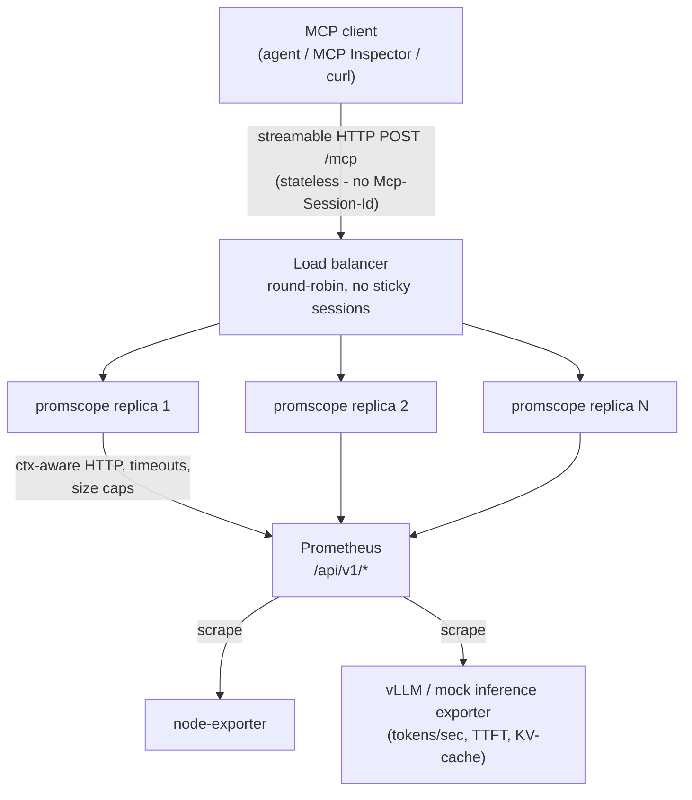
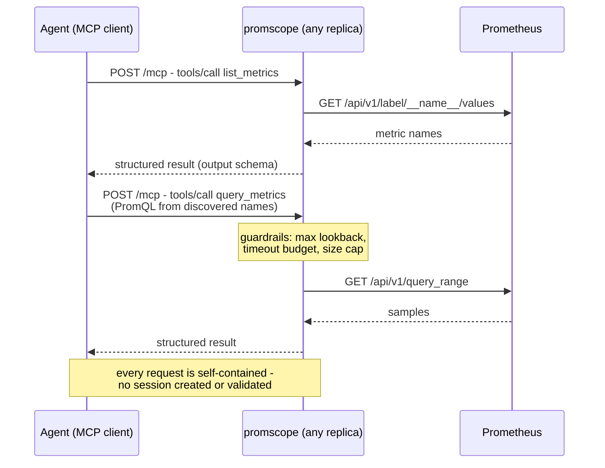

# promscope

**A stateless MCP server for LLM inference observability, in Go.**

promscope gives AI agents read-only access to Prometheus over the
[Model Context Protocol](https://modelcontextprotocol.io), built with the official
[Go SDK](https://github.com/modelcontextprotocol/go-sdk) in **stateless streamable-HTTP
mode** - no sessions, no sticky load balancing, horizontally scalable by construction.

The tools are intentionally minimal. The point of this project is the infrastructure:
what MCP's stateless mode actually changes, which protocol features survive it, and what
a production-minded MCP server looks like in Go.

> Framing: [vLLM](https://docs.vllm.ai) natively exports Prometheus metrics
> (tokens/sec, time-to-first-token, KV-cache usage). promscope is the bridge that lets an
> agent *ask questions* about an inference fleet.

## Architecture



Because the server holds **zero per-client state** and the Prometheus HTTP API is itself
stateless, any replica can serve any request - the whole stack is honestly stateless
end-to-end.

## Tool call flow



## Surface

| Name | Kind | What it does |
|---|---|---|
| `list_metrics` | tool | Discover metric names and labels (optional filter). Discovery-first: an LLM can't write PromQL for metrics it can't see. |
| `query_metrics` | tool | PromQL instant/range query with server-side guardrails (max lookback, timeout, result size cap). |
| `get_alerts` | tool | Firing and pending alerts. |
| `prometheus://rules` | resource | Alert/recording rule configuration as an MCP resource. |

All tools are annotated `readOnlyHint` / `idempotentHint` and return **structured content
with output schemas** - typed results, not string blobs.

## Why stateless?

The MCP spec is heading toward a sessionless revision, and stateless streamable HTTP is
the migration path. In the Go SDK this is `StreamableHTTPHandler{Stateless: true}`:

- no `Mcp-Session-Id` created or validated - every POST is self-contained
- replicas scale horizontally behind any dumb load balancer
- the trade-off: standalone SSE streams, resource subscriptions, and server-initiated
  notifications need a session and are **out** - this repo documents exactly where that
  boundary is

**Measured, not asserted** (full methodology and data in
[`loadtest/README.md`](loadtest/README.md)):

- promscope as shipped (stateless): **0.00% failures** behind 2-replica
  round-robin, flat ~8 MiB memory under session churn
- the rejected stateful alternative (kept behind a test flag for the A/B):
  **49.33% request failures** in the identical setup, and ~800 MiB per
  replica leaked in 120s of churn
- adding a replica changed throughput by only +4.5% - promscope was never
  the bottleneck (the shared Prometheus is), which is the honest half of the
  scaling story: stateless makes scale-out *safe*; only your bottleneck
  makes it *useful*

### Serving stateful in production - and what stateless deletes

The 49% is not inherent to stateful MCP; it is the price of deploying it
with *no remedy*, and it grows with scale: behind N-replica round-robin,
~(N-1)/N of post-handshake requests miss the session's home replica
(2 replicas -> 50%, 4 -> 75%). Production teams pay for one of these:

| Remedy | How | Ongoing cost |
|---|---|---|
| Sticky routing | LB hashes the session: `hash $http_mcp_session_id consistent` | Deploys and scale-in kill each replica's sessions; hot backends |
| External session store | Sessions in Redis - any replica loads any session | A new critical HA tier; go-sdk sessions are in-process today, so this means transport surgery |
| Platform routing | One durable instance per session, runtime routes by ID (how Cloudflare hosts remote MCP) | Coupled to that runtime |
| Client retry | Spec behavior: on 404 + session id, re-initialize | A backstop, not a strategy - latency spikes, lost context |

Stateless deletes the bill instead of financing it: no LB affinity, no
session store, no drain choreography on deploys, no per-session memory
liability (H3: ~8 KiB for every client that never says goodbye), and
autoscaling that is boring by construction. The trade - documented above -
is losing the server-push features this read-only surface never needed.

## Quickstart

```bash
docker compose -f deploy/compose.yaml up -d --build
```

That starts the full demo: Prometheus scraping node-exporter, a **mock vLLM
exporter** (verbatim `vllm:*` metric names, simulated values - swap in a real
vLLM endpoint with one scrape-config change, see `deploy/prometheus.yml`),
and **two stateless promscope replicas behind nginx round-robin** on
`http://localhost:8090/mcp` (loopback only - nothing here has auth, so
nothing here listens on the LAN). The `X-Promscope-Backend` response header
shows which replica answered.

Try it with the [MCP Inspector](https://github.com/modelcontextprotocol/inspector)
(`npx @modelcontextprotocol/inspector@2.4.0`, transport Streamable HTTP) or
replay the requests in [`docs/m2-tools.http`](docs/m2-tools.http). For local
development without Docker: `go run ./cmd/promscope` against any Prometheus.

Operational endpoints on each replica: `/healthz` (liveness) and `/metrics`
(promscope's own request counts, latencies, and upstream call outcomes).

## What it looks like to an agent

Point any MCP client at the stack - for example, in an
[opencode](https://opencode.ai) project:

```json
{
  "mcp": {
    "promscope": { "type": "remote", "url": "http://localhost:8090/mcp" }
  }
}
```

Then ask it to do actual SRE work. Real transcript against this repo's demo
stack (five tool calls, verdict verbatim):

```text
> Diagnose current inference health: p95 TTFT, 15-min trend,
  KV-cache pressure, active alerts.

⚙ promscope_list_metrics  {"filter":"vllm"}
⚙ promscope_get_alerts
⚙ promscope_query_metrics {"query":"histogram_quantile(0.95,
    sum by (le) (rate(vllm:time_to_first_token_seconds_bucket[5m])))"}
⚙ promscope_query_metrics {..., "mode":"range", "start":"-15m"}
⚙ promscope_query_metrics {"query":"vllm:gpu_cache_usage_perc"}

Verdict:
- Inference fleet is healthy: p95 TTFT is 0.539s, within the 0.47-0.62s
  band seen over the last 15 minutes.
- KV-cache at 40.5% leaves ample GPU memory headroom; no queueing or
  saturation signals.
- The only firing alert is the informational AlwaysFiring demo - no action
  needed, though the recent TTFT uptick (0.466 -> 0.539s) is worth a
  re-check in 10-15 min.
```

Note the shape: the agent *discovered* metric names before querying
(list_metrics is designed for that), used a relative-time range query, and
correctly identified the demo alert as non-actionable from its annotations -
each an ergonomics decision this server makes on purpose. The conversation
round-robined across both stateless replicas mid-diagnosis; nothing noticed.

## Configuration

Flags or `PROMSCOPE_*` env vars (flag > env > default). One deliberate sharp
edge: a *malformed* env value refuses to boot even when a flag overrides it -
broken env deserves fixing, not shadowing. Guardrail limits must be identical
across replicas.

| Env var | Default | Meaning |
|---|---|---|
| `PROMSCOPE_LISTEN_ADDR` | `:8090` | HTTP listen address |
| `PROMSCOPE_PROMETHEUS_URL` | `http://localhost:9090` | Upstream Prometheus |
| `PROMSCOPE_STATELESS` | `true` | Stateless transport (false exists solely for the load-test A/B) |
| `PROMSCOPE_MAX_LOOKBACK` | `24h` | Widest range-query window (bounds the requested window; PromQL `offset`/`@` can still reach older data - compute isolation is Prometheus's job) |
| `PROMSCOPE_MAX_SERIES` | `50` | Series per result before truncation |
| `PROMSCOPE_MAX_POINTS` | `200` | Points-per-series budget (drives step auto-compute) |
| `PROMSCOPE_QUERY_TIMEOUT` | `10s` | Per-call budget for every tool and resource; queries hand Prometheus 90% of it |
| `PROMSCOPE_MAX_METRIC_NAMES` | `500` | list_metrics cap |
| `PROMSCOPE_MAX_INFLIGHT` | `10` | Concurrent upstream requests; beyond it callers get a retryable overload error |
| `PROMSCOPE_MAX_RESPONSE_BYTES` | `1048576` | Cap on any upstream response body |

## Accepted limitations

- **No auth** - deliberate scope decision; front it with your own gateway if exposed.
- **Read-only** - no write path exists.
- Three tools, frozen. Robustness over surface area.

See [docs/SPEC.md](docs/SPEC.md) for the full specification, architecture decisions, and
milestone plan.
